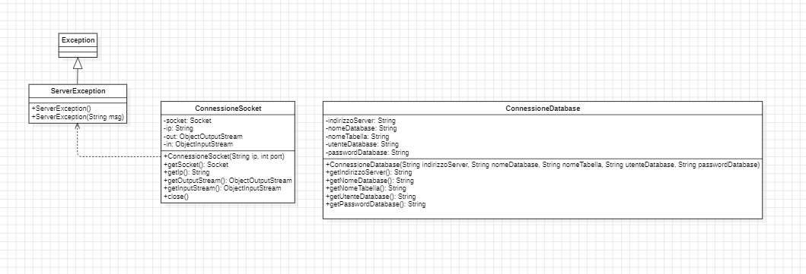
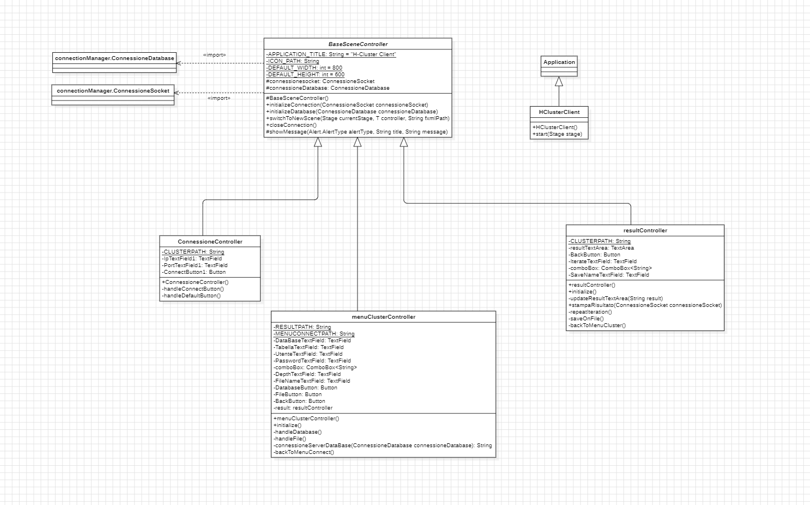
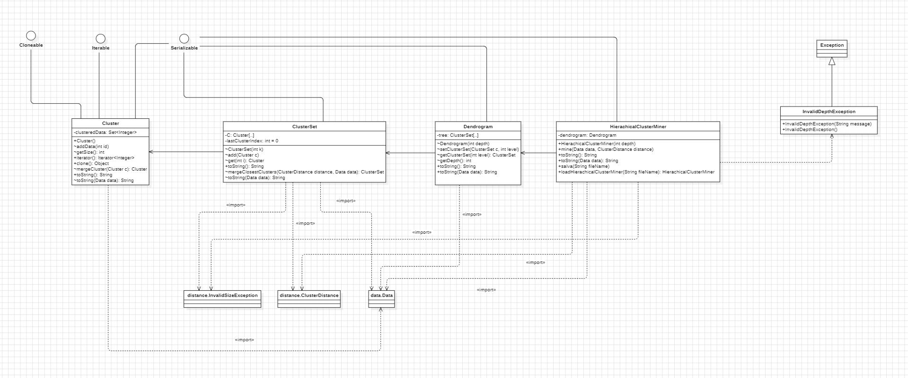
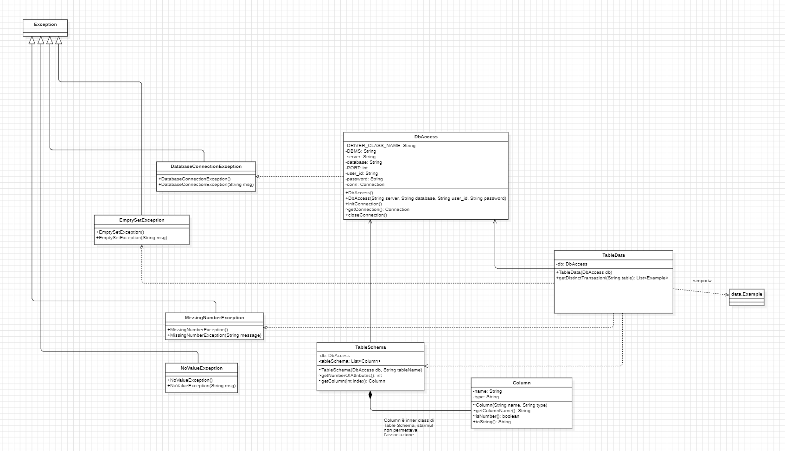
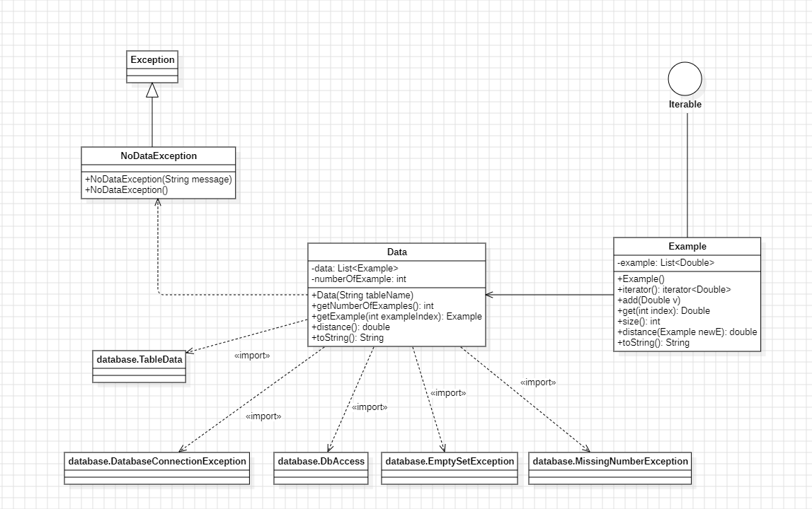
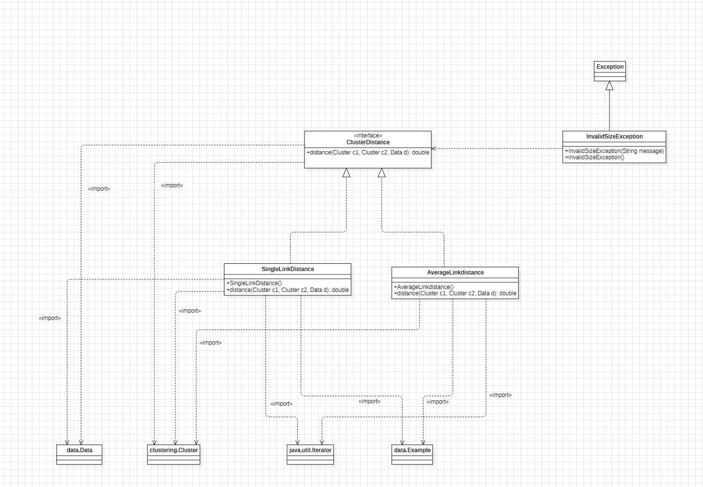
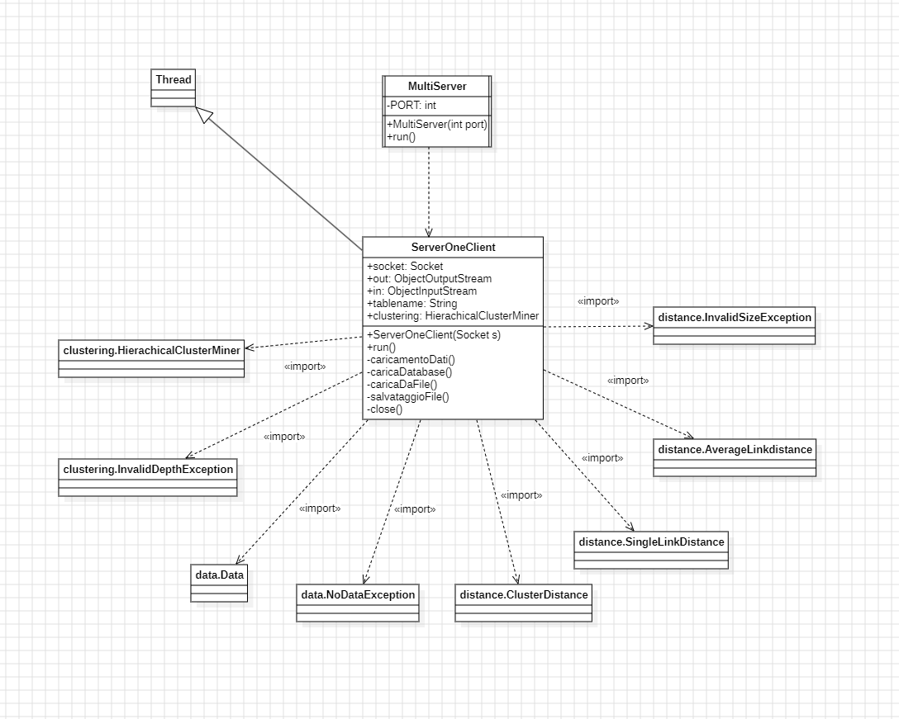

# H-Cluster - Hierarchical Clustering Application

Applicazione client-server per clustering gerarchico con interfaccia JavaFX.

## 📋 Descrizione

Sistema di clustering gerarchico che permette di:
- Caricare dati da database MySQL o da file
- Eseguire clustering con Single Link o Average Link distance
- Visualizzare dendrogrammi interattivi
- Salvare risultati per analisi future

## 🏗️ Architettura

### Client



### Server






## 🛠️ Tecnologie Utilizzate

- **Java 21** - Linguaggio di programmazione
- **JavaFX 21** - Interfaccia grafica
- **MySQL 8.x** - Database relazionale
- **JDBC** - Connessione al database
- **Socket Programming** - Comunicazione client-server
- **Multi-threading** - Gestione connessioni multiple

## 📦 Requisiti

- Java Development Kit (JDK) 21
- JavaFX SDK 21
- MySQL Server 8.x
- Driver JDBC MySQL 8.0.17 (incluso in `server/lib/`)

## 🚀 Installazione

### 1. Clona il repository
```bash
git clone https://github.com/TUO_USERNAME/H-ClusterEstensione.git
cd H-ClusterEstensione
```

### 2. Configura JavaFX

Scarica JavaFX SDK 21 da [https://gluonhq.com/products/javafx/](https://gluonhq.com/products/javafx/)

Modifica `compile-all.bat` e `start-client.bat` con il percorso corretto:
```batch
--module-path "PERCORSO\DOVE\HAI\ESTRATTO\javafx-sdk-21\lib"
```

### 3. Setup Database

1. Avvia MySQL Server
2. Esegui lo script SQL:
```bash
mysql -u root -p < database/scriptH-Cluster.sql
```

Oppure importa manualmente `database/scriptH-Cluster.sql` in phpMyAdmin o MySQL Workbench.

## ▶️ Esecuzione

### Windows

1. **Compila il progetto:**
```bash
   compile-all.bat
```

2. **Avvia il server** (lascialo in esecuzione):
```bash
   start-server.bat
```

3. **Avvia il client** (in una nuova finestra):
```bash
   start-client.bat
```

### Linux/Mac
```bash
# Compila server
cd server/src
javac -cp "../lib/mysql-connector-java-8.0.17.jar" -d ../../bin/server *.java clustering/*.java data/*.java database/*.java distance/*.java
cd ../..

# Compila client
cd client/src
javac --module-path "/path/to/javafx-sdk-21/lib" --add-modules javafx.controls,javafx.fxml -d ../../bin/client Main.java gui/*.java connectionManager/*.java
cd ../..

# Copia risorse
cp -r server/DataStore bin/server/
cp server/lib/mysql-connector-java-8.0.17.jar bin/server/
cp -r client/src/resources bin/client/

# Avvia server
java -cp "bin/server:bin/server/mysql-connector-java-8.0.17.jar" MultiServer &

# Avvia client
java --module-path "/path/to/javafx-sdk-21/lib" --add-modules javafx.controls,javafx.fxml -cp bin/client Main
```

## 📂 Struttura del Progetto
```
H-ClusterEstensione/
├── client/               # Applicazione client JavaFX
│   └── src/
│       ├── connectionManager/  # Gestione connessioni
│       ├── gui/                # Controller JavaFX
│       └── resources/          # FXML, CSS, immagini
├── server/               # Server multi-threaded
│   ├── src/
│   │   ├── clustering/   # Algoritmi di clustering
│   │   ├── data/         # Gestione dati
│   │   ├── database/     # Accesso al database
│   │   └── distance/     # Calcolo distanze
│   ├── lib/              # Librerie esterne (JDBC)
│   └── DataStore/        # File di dati salvati
├── database/             # Script SQL
├── docs/                 # Diagrammi UML
├── compile-all.bat       # Script compilazione
├── start-server.bat      # Avvio server
└── start-client.bat      # Avvio client
```

## 🎯 Funzionalità

- **Carica da Database**: Importa dati da tabelle MySQL
- **Carica da File**: Ricarica dendrogrammi salvati precedentemente
- **Single Link Distance**: Algoritmo di clustering single-linkage
- **Average Link Distance**: Algoritmo di clustering average-linkage
- **Profondità Personalizzabile**: Scegli la profondità del dendrogramma
- **Salva Risultati**: Esporta dendrogrammi per analisi future
- **Interfaccia Intuitiva**: GUI moderna con JavaFX

## 👨‍💻 Autore

Giuseppe Conversano

## 📄 Licenza

Progetto sviluppato per scopi accademici.